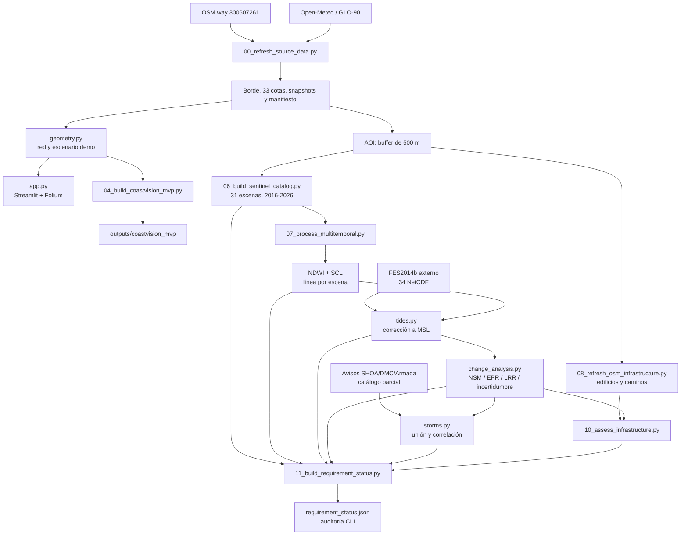

# Arquitectura unificada de CoastVision

## Dos ramas con una frontera explícita

CoastVision mantiene una rama demostrativa estable para la presentación y una rama científica reproducible para cumplir la pauta. La segunda todavía no sustituye las capas de escenario de la primera.



## Componentes y contratos

| Componente | Responsabilidad | Entrada principal | Salida o contrato |
|---|---|---|---|
| `src/coastvision/acquisition.py` | Validar OSM/DEM, snapshots y hashes | APIs o `data/raw/` | Bundle base trazable |
| `src/coastvision/geometry.py` | CRS, red, escenario y evaluación de clic | Borde OSM, cotas, año y tasa | Capas demostrativas |
| `app.py` | Mostrar mapa, mediciones y resultados obligatorios | Bundle base y salidas científicas | Visor con cinco indicadores y siete elementos cartográficos |
| `scripts/04_build_coastvision_mvp.py` | Exportar un escenario demo | Parámetros y bundle base | GeoJSON, CSV, resumen y procedencia |
| `src/coastvision/sentinel.py` | Descubrir escenas y extraer NDWI | B03, B08, SCL y AOI | Raster NDWI, agua y línea bruta |
| `scripts/06_build_sentinel_catalog.py` | Catalogar escenas estivales 2016–2026 | AOI y catálogos STAC | `data/sentinel/catalog_2016_2026.json` |
| `scripts/07_process_multitemporal.py` | Orquestar NDWI, marea, cambio y marejadas | Catálogo, assets, FES y eventos | Bundle multitemporal o estado parcial explícito |
| `src/coastvision/tides.py` | Predecir marea y desplazar línea | FES2014, fecha, pendiente y orientación | Línea corregida a MSL |
| `src/coastvision/change_analysis.py` | Equivalente DSAS en Python | Líneas corregidas y transectos fijos | NSM, EPR, LRR, R², SE e IC95 |
| `src/coastvision/storms.py` | Vincular marejadas y anomalías | Fechas, tasas/eventos | Unión temporal y correlación exploratoria |
| `scripts/08_refresh_osm_infrastructure.py` | Descargar infraestructura | AOI y Overpass/OSM | Snapshots de `building=*` y `highway=*` |
| `src/coastvision/infrastructure.py` | Evaluar exposición de activos | Infraestructura, línea reciente y LRR | Distancia, horizonte y clase de riesgo |
| `scripts/10_assess_infrastructure.py` | Materializar el cruce | Capas OSM y tasas reales | GeoJSON y resumen con hashes |
| `scripts/11_build_requirement_status.py` | Auditar artefactos obligatorios | Archivos realmente presentes | `outputs/requirement_status.json` |

## Decisiones de diseño

1. **CRS separados.** WGS84 se usa para catálogos, APIs y GeoJSON; Leaflet proyecta el lienzo en EPSG:3857; UTM 19S se usa para metros, transectos, offsets y tasas.
2. **Descarga fuera de la demo.** La presentación consume bundles preparados y no depende de llamadas remotas.
3. **Estado derivado desde artefactos.** La existencia de un módulo no convierte un requisito en completo.
4. **FES2014 externo.** El modelo pesa cerca de 4,5 GB y no entra en Git ni en los ZIP incrementales.
5. **Primero marea, después tasas.** NSM/EPR/LRR solo se calculan sobre líneas corregidas y fechadas.
6. **Catálogo de eventos con cobertura explícita.** Un año sin filas no se interpreta como ausencia de marejadas.
7. **Riesgo de infraestructura trazable.** Se combinan distancia a la línea más reciente y LRR local, con fuente, fecha y hashes.
8. **Visor demostrativo aislado.** Las líneas 2017/futura visibles no se presentan como resultados satelitales.
9. **Producto enfocado.** La interfaz muestra únicamente mapa, mediciones y los cinco resultados obligatorios; la auditoría queda en scripts y documentos.

## Modos de ejecución

```text
Base online:   APIs OSM/Open-Meteo -> validación -> snapshots + activos + manifiesto
Base offline:  snapshots -> validación -> mismo bundle
Demo:          bundle base -> geometry.py -> app / exportación
Catálogo:      AOI -> script 06 -> 31 escenas 2016-2026
Científico:    catálogo/assets + FES -> script 07 -> NDWI -> marea -> DSAS -> marejadas
Infraestructura: AOI -> script 08 -> OSM -> script 10 + tasas reales
Auditoría:     artefactos presentes -> script 11 -> JSON de estado para revisión interna
```

## Estado de integración

- **Operativo:** visor, estaciones, DEM, exportación, once líneas Sentinel/NDWI/FES2014, 38 LRR válidas y semáforo OSM conectado.
- **Ejecutado con limitación explícita:** correlación de marejadas con n=11; el catálogo oficial sigue parcial y no permite inferencia causal.
- **Auditoría interna:** el script 11 conserva el estado detallado fuera de la interfaz del producto.

El contrato de promoción es simple: `app.py` solo consume tasas y capas científicas cuando `scientific_pipeline_ready` valida la cadena Sentinel/NDWI/FES2014/LRR/OSM y sus artefactos.
