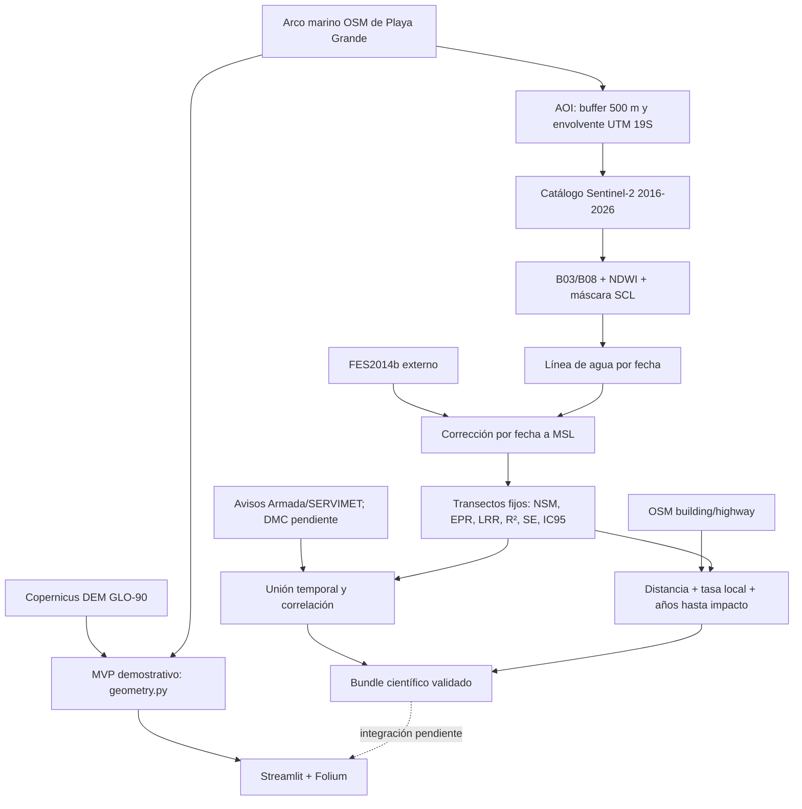

# Unificación, arquitectura y cumplimiento obligatorio

**Corte de evidencia:** 16 de julio de 2026  
**Sitio piloto:** Playa Grande de Cartagena  
**CRS métrico:** UTM 19S (`EPSG:32719`)  
**CRS de los datos publicados:** WGS84 (`EPSG:4326`)  
**Proyección del lienzo web:** Web Mercator (`EPSG:3857`)

Este documento registra qué se incorporó desde la versión del compañero, qué está realmente ejecutado y qué falta para afirmar que los requisitos obligatorios están cumplidos. Los estados se asignan por evidencia, no por la presencia de comentarios o funciones en el código.

## Criterio de estados

- **Validado:** se ejecutó sobre datos reales del proyecto y existe un artefacto revisable.
- **Implementado:** existe código funcional y pruebas unitarias, pero falta ejecutarlo de extremo a extremo con todos los datos reales.
- **Parcial:** existe una parte del código o de los datos reales, pero falta cobertura temporal, fuente, validación o integración.
- **Pendiente:** no existe todavía un resultado verificable para el caso real.

Un requisito solo se declarará **cumplido** cuando sus datos reales, procesamiento, control de calidad, salida y visualización estén presentes y sean reproducibles.

## Decisión de unificación

Se conservó como base el proyecto actual porque ya tenía:

- aplicación Streamlit/Folium funcional;
- delimitación reproducible de Playa Grande;
- once estaciones, transectos y evaluación por coordenadas;
- DEM, procedencia, exportaciones, documentación y pruebas;
- un alcance honesto que distingue observaciones de escenarios.

De la versión del compañero se rescataron y refactorizaron las ideas útiles:

- consulta Sentinel-2 y cálculo NDWI;
- corrección de marea con pyTMD/FES2014;
- cambio costero mediante transectos;
- consulta de edificios y caminos OSM;
- estructura de visualización de los siete elementos cartográficos.
- animación temporal demostrativa 2017→2026, control explícito de capas y exportaciones locales.

No se integraron:

- el segundo frontend React/FastAPI, para no mantener dos aplicaciones;
- el modelo FES2014 de 4,5 GB, que debe permanecer externo;
- el procesamiento anual usa consenso NDWI multiescena en UTM 19S cuando hay al menos dos escenas válidas; con una sola escena se conserva un fallback explícito y no se oculta la incertidumbre;
- `node_modules`, cachés opacos o rutas personales;
- el script que contenía una credencial incrustada.

## Arquitectura unificada



Hay dos ramales deliberadamente separados:

1. **MVP demostrativo actual:** usa OSM, DEM y escenarios lineales para una demo rápida.
2. **Pipeline científico:** producirá las observaciones 2016–2026 y reemplazará el escenario solo después de completar FES2014, tasas, marejadas, infraestructura y QA.

El visor unificado también incorpora funciones rescatadas de la interfaz del compañero: interpolación temporal visual, activación y desactivación de capas, carga opcional de edificios/caminos OSM evaluados y descarga de perfil, transectos y evaluación puntual. Estas funciones de presentación no convierten datos demostrativos en observaciones científicas.

La separación evita presentar una proyección geométrica como si fuera una observación Sentinel-2.

## Datos y delimitación de la playa

La playa se delimita desde `data/playa_grande_shoreline_osm.geojson`, derivado del arco marino del polígono OSM `natural=beach` de Playa Grande. Los extremos norte y sur se seleccionan una vez y la línea resultante mide aproximadamente 1,87 km.

Para Sentinel-2, `scripts/06_build_sentinel_catalog.py`:

1. reproyecta la línea a UTM 19S;
2. aplica un buffer de 500 m a toda la línea;
3. obtiene la envolvente rectangular;
4. la transforma a WGS84 para la consulta STAC.

El AOI resultante es aproximadamente:

```text
Oeste  -71.6273102
Sur    -33.5196197
Este   -71.6046611
Norte  -33.4970742
```

Esta extensión cubre toda Playa Grande, mar adentro y la primera franja urbana. No equivale a afirmar que todo el rectángulo pertenece a la playa; es el área de adquisición y análisis.

## Matriz honesta de los siete requisitos obligatorios

| Nº | Requisito | Implementación disponible | Evidencia real actual | Estado | Trabajo necesario para cerrarlo |
|---:|---|---|---|---|---|
| 1 | Extraer línea costera de Sentinel-2 multitemporales 2016–2026 | `sentinel.py`, scripts 06–07, catálogo anual enero–marzo | 31 escenas catalogadas; 28 aceptadas y 11 líneas anuales | **Completo** | QA visual reforzado de 2016 L1C |
| 2 | Aplicar NDWI o MNDWI | NDWI `=(B03-B08)/(B03+B08)`, alineación, SCL cuando existe, mayoría anual y vectorización | Once resultados anuales 2016–2026 | **Completo** | Documentar incertidumbre L1C/L2A |
| 3 | Calcular tasas con DSAS o equivalente Python | Transectos fijos, NSM, EPR, LRR, R², error estándar e IC95 Student-t | 39 transectos, 336 intersecciones y 38 LRR válidas | **Completo** | Revisar transectos con menor completitud |
| 4 | Correlacionar con eventos de marejadas SHOA/DMC | Unión temporal, anomalía sin tendencia y correlación punto-biserial | n=11, r=-0,405, p=0,216; catálogo oficial incompleto | **Ejecutado, parcial** | Certificar exhaustividad oficial antes de interpretar |
| 5 | Identificar infraestructura costera en riesgo | Descarga OSM y cruce con costa reciente, LRR local y horizonte | 38 edificios, 252 tramos y semáforo conectado | **Completo como screening** | Revisar cobertura OSM y validar en terreno |
| 6 | Corrección de marea FES2014 | Validación, predicción pyTMD y corrección por escena antes de la mediana anual | 34/34, 28 correcciones y 11 líneas MSL | **Completo** | Mantener sensibilidad de pendiente 0,03–0,08 |
| 7 | Incluir los siete elementos obligatorios del mapa | Controles Folium/HTML en `app.py` | Los siete están implementados y fueron verificados visualmente en la aplicación local | **Validado para el MVP** | Actualizar automáticamente fecha, fuentes y leyenda cuando el visor consuma resultados científicos |

### Desglose de los siete elementos cartográficos

| Elemento | Implementación actual | Estado |
|---|---|---|
| Título | Control sobre el mapa con tema, periodo y Playa Grande | Implementado |
| Leyenda | Simbología de franjas, costa, estaciones y transectos | Implementado; debe actualizarse al integrar tasas reales |
| Escala | Control métrico nativo de Folium/Leaflet | Implementado |
| Norte | Flecha fija, válida mientras el mapa permanezca norte-arriba | Implementado |
| Fuente / autor | OSM, Copernicus DEM, Sentinel-2/FES cuando corresponda y CoastVision/USACH | Implementado |
| CRS / proyección | Datos/API en WGS84, lienzo web en EPSG:3857 y cálculos en UTM 19S | Implementado |
| Fecha | Periodo de análisis y año de elaboración | Implementado |

## Evidencia disponible

### Sentinel-2 y NDWI

- `data/sentinel/catalog_2016_2026.json`: 31 escenas, años 2016–2026 sin huecos de catálogo.
- `outputs/multitemporal/shorelines_raw_ndwi.geojson`: once líneas anuales reales 2016–2026.
- `outputs/multitemporal/water_2017.geojson` y `water_2026.geojson`: consensos de agua.
- `outputs/multitemporal/pipeline_summary.json`: 28 recibos válidos; estado global parcial solo por marejadas.

El gráfico de control demuestra que el algoritmo recorre la playa completa, pero también muestra una separación importante respecto de OSM en el tramo norte. Antes de aceptar 2017 como línea definitiva se necesita revisar la imagen base, el umbral NDWI y la selección de intersecciones.

### FES2014

- `outputs/fes2014_validation.json`: 34 constituyentes, 4.517.905.924 bytes y cabeceras válidas.
- `prediction_status`: `validated`; altura de muestra 0,6263 m.
- `fes2014_corrected_years`: 2016–2026; 28 filas en `tide_corrections.csv`.

Por lo tanto, estructura, predicción y corrección están validadas para dos años; la serie completa sigue pendiente.

### Eventos

- `data/events/marejadas_oficiales_armada.csv`: 16 avisos oficiales parciales.
- `data/events/README.md`: alcance, huecos y rol auxiliar de ERA5.
- `data/events/catalog_metadata.json`: declara `catalog_complete: false`, años
  revisados y años todavía pendientes.
- `scripts/07_process_multitemporal.py`: cuando existen al menos dos líneas
  corregidas, genera `storm_scene_join.csv` y `storm_correlation.json` y mantiene
  el resultado como exploratorio mientras el catálogo siga incompleto.

El CSV actual no contiene filas DMC ni una serie continua SHOA. ERA5 no se
etiqueta como SHOA/DMC ni como sustituto de un catálogo institucional.

### Infraestructura y estado de cumplimiento

- `scripts/08_refresh_osm_infrastructure.py`: snapshot OSM nombrado y capas de
  edificios/caminos.
- `scripts/10_assess_infrastructure.py`: cruce reproducible con la línea más
  reciente y `lrr_m_per_year`, con hashes de cada insumo.
- `scripts/11_build_requirement_status.py`: sintetiza el estado desde artefactos
  reales sin ejecutar ni simular los pipelines.
- `outputs/requirement_status.json`: estado actual
  `MVP_UNIFICADO_CON_PENDIENTES_DE_DATOS`, con `strict_completion: false`.

`outputs/infrastructure_risk/summary.json` y sus dos GeoJSON existen. El script
El script 11 marca infraestructura como completa para screening porque las LRR
cubren 2016–2026; el resultado igualmente requiere validación de campo.

### Pruebas

- Suite global posterior a todas las integraciones: **53/53 aprobadas en 8,04 s**.
- JUnit actualizado: `outputs/coastvision_mvp/pytest.xml`.
- Cobertura funcional: geometría, adquisición, NDWI/consenso, FES2014, DSAS, marejadas, infraestructura, RAG y visualización.

## Comandos reproducibles

### Preparación

```powershell
python -m venv .venv --system-site-packages
.\.venv\Scripts\python.exe -m pip install -r requirements.txt
```

### MVP sin internet

```powershell
.\.venv\Scripts\python.exe scripts\00_refresh_source_data.py --offline
.\.venv\Scripts\python.exe scripts\04_build_coastvision_mvp.py
.\.venv\Scripts\python.exe scripts\run_mvp.py
```

### Catálogo Sentinel-2

```powershell
.\.venv\Scripts\python.exe scripts\06_build_sentinel_catalog.py `
  --buffer-m 500 --max-cloud 20 --scenes-per-year 3
```

### Extracción NDWI reproducida

```powershell
.\.venv\Scripts\python.exe scripts\07_process_multitemporal.py `
  --years 2017 --output outputs\multitemporal_validation_v2
```

### FES2014 externo

```powershell
$env:TIDE_MODEL_DIR="C:\ruta\segura\tide_models"
.\.venv\Scripts\python.exe scripts\09_validate_fes2014.py `
  --model-dir "$env:TIDE_MODEL_DIR"
.\.venv\Scripts\python.exe scripts\09_validate_fes2014.py `
  --model-dir "$env:TIDE_MODEL_DIR" --predict
```

Estructura requerida:

```text
tide_models/
└─ fes2014/
   └─ ocean_tide/
      ├─ m2.nc
      ├─ s2.nc
      └─ ... 34 constituyentes
```

### Serie completa y tasas

```powershell
.\.venv\Scripts\python.exe scripts\07_process_multitemporal.py `
  --years 2016 2017 2018 2019 2020 2021 2022 2023 2024 2025 2026 `
  --tide-model-dir "$env:TIDE_MODEL_DIR" `
  --local-assets data\sentinel\local_assets.json `
  --output outputs\multitemporal
```

Formato opcional de `local_assets.json` si se prefiere sustituir el asset público L1C de 2016 por archivos locales:

```json
{
  "S2A_MSIL1C_20160214T145122_N0500_R096_T19HBC_20231013T012427": {
    "green": "C:/datos/2016/B03.jp2",
    "nir": "C:/datos/2016/B08.jp2"
  }
}
```

2016 es L1C y no incluye SCL como los productos L2A posteriores. Debe declararse esa diferencia de nivel de procesamiento y someter la línea a QA visual antes de combinarla con el resto.

El script 07 usa por defecto `data/events/marejadas_oficiales_armada.csv` y
`data/events/catalog_metadata.json`. Después de las tasas genera la unión por
escena y la correlación, pero no marca el requisito como completo mientras
`catalog_complete` sea falso.

### Infraestructura OSM

```powershell
.\.venv\Scripts\python.exe scripts\08_refresh_osm_infrastructure.py
.\.venv\Scripts\python.exe scripts\10_assess_infrastructure.py
```

El segundo comando requiere que el script 07 ya haya producido
`shorelines_2016_2026_fes2014.geojson` y `transect_rates.geojson`. Si falta
alguno, termina con un error explícito en vez de inventar un resultado.

### Estado obligatorio derivado de artefactos

```powershell
.\.venv\Scripts\python.exe scripts\11_build_requirement_status.py
```

Salida: `outputs/requirement_status.json`. Debe ejecutarse nuevamente después de
cada corrida de los scripts 07 o 10. Un estado `COMPLETO` solo aparece si están
presentes los artefactos requeridos; el archivo actual declara
`strict_completion: false`.

### Suite completa

```powershell
.\.venv\Scripts\python.exe -m pytest -q
```

## Seguridad y distribución

1. FES2014 es externo por tamaño y condiciones de distribución. No se copia al repositorio ni a los ZIP.
2. `.env` y credenciales están excluidos. `.env.example` contiene solo una ruta ilustrativa.
3. La versión del compañero contenía una credencial en texto plano. No se importó; debe rotarse en AVISO+ sin reutilizarla ni publicarla.
4. Los snapshots OSM y catálogos Sentinel deben conservar fecha, consulta, proveedor y URL.
5. No se deben versionar `node_modules`, cachés opacos ni artefactos temporales.

## Prioridad para completar el cumplimiento

1. Descargar y procesar 2016; ejecutar NDWI 2018–2026 y hacer QA de las once líneas.
2. Completar la predicción FES2014 y generar las once líneas corregidas a MSL.
3. Generar `transect_rates.geojson/csv` con NSM, EPR, LRR e incertidumbre reales.
4. Completar el catálogo institucional de marejadas y exportar la correlación con tamaños de muestra.
5. Descargar edificios/caminos OSM y calcular exposición con tasas reales.
6. Conectar esos artefactos al visor sin retirar los rótulos de incertidumbre.
7. Ejecutar la suite global y la revisión visual final de la demo.

Hasta cerrar esos puntos, el proyecto es un **MVP demostrativo con pipeline científico parcial**, no una herramienta habilitada para decisiones inmobiliarias o de seguridad costera.
